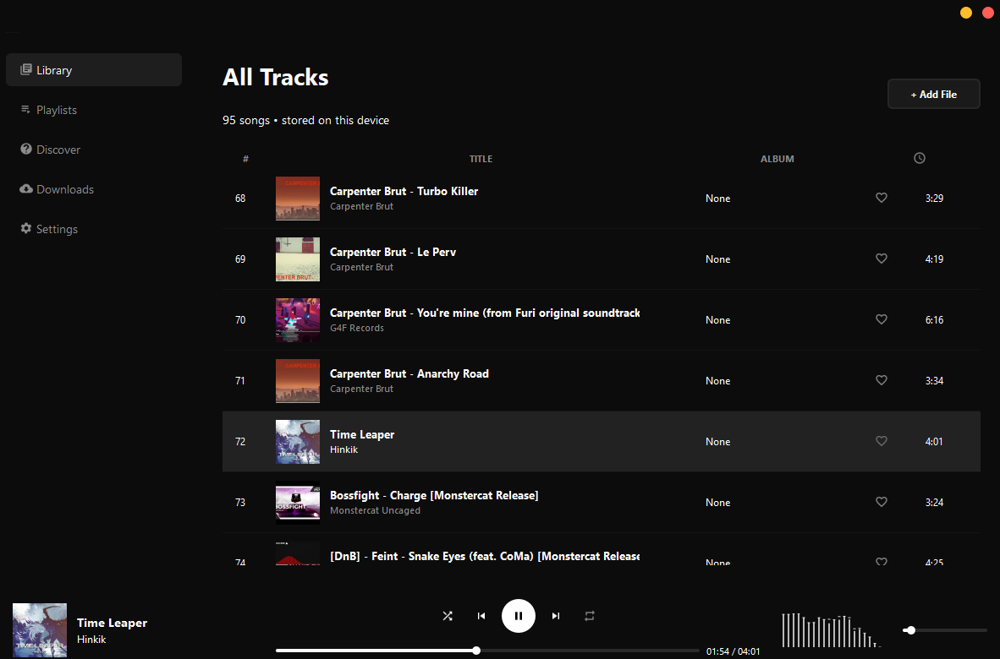
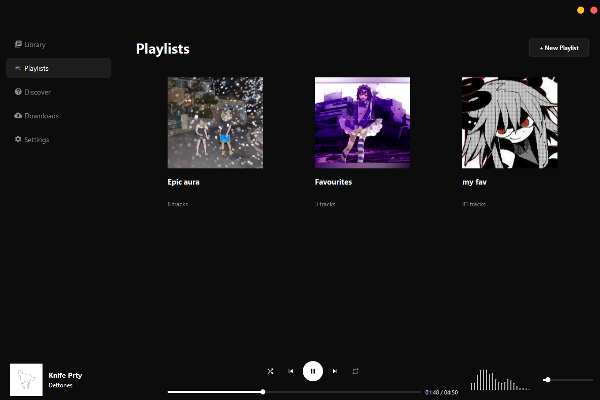
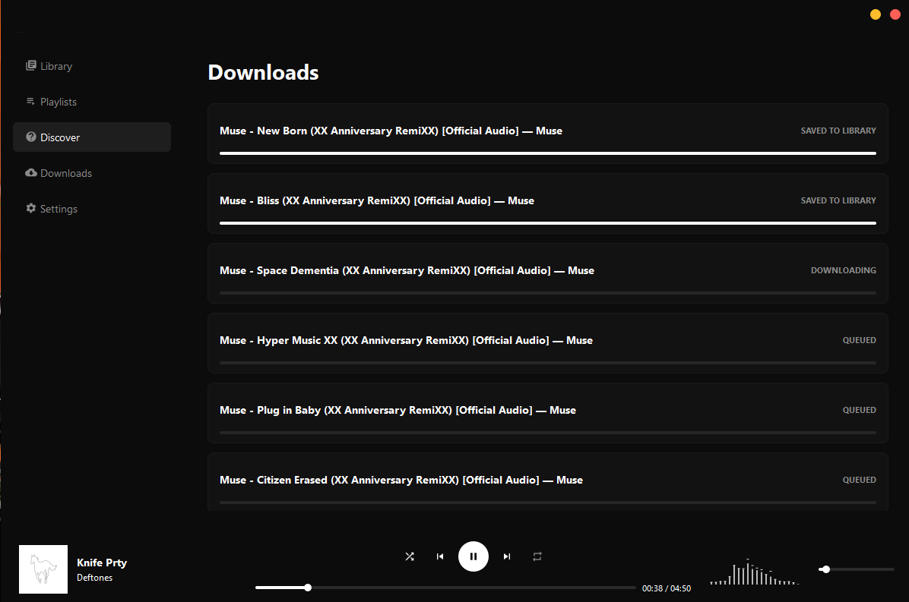

# Maya 
this is very fast, minimalist audio player made on cxx23 standarts and qt6. uses bass audio library to play audio files and yt-dlp to download tracks from YouTube 
## Screenshots

*All your local music in one place*

*Simple cards for your playlists*

*Downloads queue is fast and download track by track*

## What's a Maya have?
* **Audio Engine**: pure float DSP, gapless playback, normalisation, and equalizer (bass library used)
* **Web downloader**: search and download songs from YouTube. downloader works in background
* **Discord RPC**: show what you listen on your Discord profile
* **Configs**: all changes is saved file `libraby.json` from your %LOCALAPPDATA% system dir... and etc func...
## Disclaimers / Small Bugs
* Discord RPC might not connect if Discord is closed when you start player (just restart)
* Theme switcher is temporary disabled in UI (not fine)
* If some YouTube link is blocked in your country, download will blocked. press "Try again" or "Skip"
